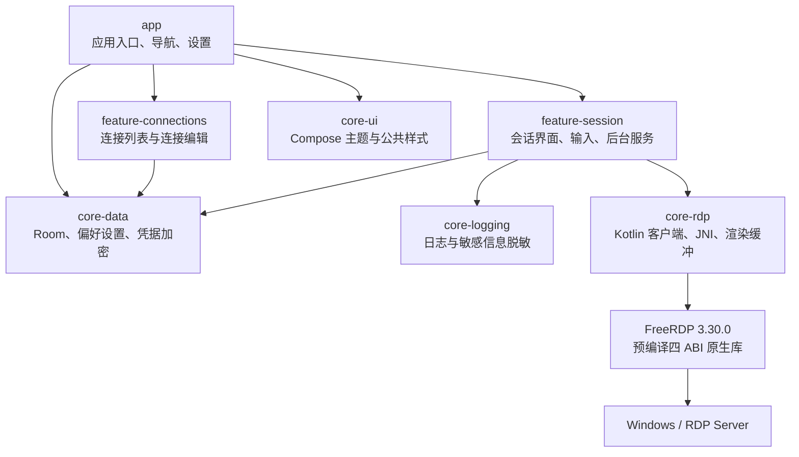

<div align="center">
  

  # PocketRDP

  **轻量、现代、面向触屏体验的 Android RDP 客户端**

  基于 Kotlin、Jetpack Compose Material 3 与 FreeRDP 构建，支持远程桌面、H.264、动态分辨率、触控输入、剪贴板、文件重定向、远程音频与可选 RDP-UDP 多传输。

  <p>
    <a href="https://github.com/HanFengRuYue/PocketRDP/stargazers"></a>
    <a href="https://github.com/HanFengRuYue/PocketRDP/forks"></a>
    <a href="https://github.com/HanFengRuYue/PocketRDP/issues"></a>
    <a href="https://github.com/HanFengRuYue/PocketRDP/commits/main"></a>
    <a href="LICENSE"></a>
    <a href="https://github.com/HanFengRuYue/PocketRDP"></a>
  </p>
  <p>
    <a href="https://developer.android.com/about/versions/12"></a>
    <a href="gradle/libs.versions.toml"></a>
    <a href="https://github.com/FreeRDP/FreeRDP/tree/3.30.0"></a>
  </p>

  [功能特色](#-功能特色) · [快速开始](#-快速开始) · [项目架构](#-项目架构) · [原生构建](#-freerdp-原生构建) · [参与贡献](#-参与贡献)
</div>

## ✨ 功能特色

| 类别 | 能力 |
| --- | --- |
| 🖥️ 远程桌面 | 基于 FreeRDP 3.30.0，支持 GFX、H.264、RFX、32 位色深、自动重连与实时会话状态。 |
| 🎞️ 图像与性能 | Android MediaCodec 优先解码 H.264，静态链接 FFmpeg 作为回退；可选 AVC420 流畅优先或 AVC444 画质优先。 |
| 📐 分辨率 | 支持动态分辨率、自定义固定分辨率、远程桌面缩放、动态分辨率上限及目标帧率。 |
| 👆 输入体验 | 支持模拟鼠标、原生 RDPEI 触控、多点触控、手势、虚拟键盘、组合键及中英文文本输入。 |
| 📋 重定向 | 支持双向文本剪贴板、手机存储文件夹重定向，以及远程音频在手机或被控端播放。 |
| 🌐 网络传输 | 默认使用 TCP；可按连接启用 RDP-UDP v1/v2、UDP2 v3、可靠 UDP 与可选低延迟 UDP 通道。 |
| 🔄 会话管理 | 每个会话独立持有 RDP 客户端与渲染缓冲，支持后台前台服务、Wi-Fi/Wake Lock、会话预览和聚合通知。 |
| 🎨 现代界面 | Jetpack Compose Material 3、多主题、深色模式、多语言界面、连接卡片与可调透明度控件。 |
| 🔐 安全设计 | 密码使用 Android Keystore 绑定的 AES-GCM 加密；证书采用 SHA-256 指纹确认与端点绑定；日志对敏感参数脱敏。 |

## 📊 GitHub 仓库数据

顶部的 Stars、Forks、Issues、最近提交、许可证与仓库大小徽章均由 GitHub 数据动态生成，会随仓库状态自动更新。

| 仓库入口 | 说明 |
| --- | --- |
| [提交历史](https://github.com/HanFengRuYue/PocketRDP/commits/main) | 查看 `main` 分支的开发记录。 |
| [Issues](https://github.com/HanFengRuYue/PocketRDP/issues) | 报告问题、提交功能建议或跟踪修复进度。 |
| [Pull Requests](https://github.com/HanFengRuYue/PocketRDP/pulls) | 查看和参与代码审查。 |
| [Contributors](https://github.com/HanFengRuYue/PocketRDP/graphs/contributors) | 查看仓库贡献者统计。 |
| [Insights](https://github.com/HanFengRuYue/PocketRDP/pulse) | 查看提交活跃度与仓库变化。 |
| [Security](https://github.com/HanFengRuYue/PocketRDP/security) | 查看安全策略、扫描和安全公告。 |

当前仓库以 **Kotlin** 为主要语言，默认分支为 **`main`**，采用 **MIT License**。发行包请以 [Releases](https://github.com/HanFengRuYue/PocketRDP/releases) 页面为准；如果页面尚无资产，请按本文从源码构建。

## 🧱 技术栈

| 层级 | 技术与版本 |
| --- | --- |
| 语言与 UI | Kotlin 2.4.10、Jetpack Compose、Material 3、Compose BOM 2026.06.01 |
| 架构与数据 | Hilt 2.60.1、Room 2.8.4、DataStore、Kotlin Coroutines |
| Android 工具链 | AGP 9.3.1、Gradle 9.6.1、JVM Target 17、JBR/JDK 21 |
| Android 平台 | compile/target SDK 37、min SDK 31（Android 12） |
| 原生工具链 | NDK 29.0.14206865、CMake 4.1.2、FreeRDP 3.30.0 |
| 媒体栈 | Android MediaCodec、静态链接 FFmpeg n8.1.2 |

## 🚀 快速开始

### 1. 准备环境

- Windows 10/11 与 Android Studio（包含 JBR 21）
- Android SDK Platform 37
- Git，并启用 Git submodule
- 用于运行应用的 Android 12 或更高版本设备

普通 Android 构建直接打包仓库中已提交的四架构原生库，不需要在 Windows 上编译 C/C++，也不要求 WSL2。只有修改 JNI 或 FreeRDP 原生核心时才需要执行[原生构建](#-freerdp-原生构建)。

### 2. 克隆仓库

```powershell
git clone --recurse-submodules https://github.com/HanFengRuYue/PocketRDP.git
Set-Location PocketRDP
```

如果克隆时没有拉取子模块：

```powershell
git submodule update --init --recursive
```

### 3. 配置 Windows Java 环境

所有 Windows Gradle 命令必须使用 Android Studio 自带的 JBR 21：

```powershell
$env:JAVA_HOME = "C:\Program Files\Android\Android Studio\jbr"
$env:Path = "$env:JAVA_HOME\bin;$env:Path"
java -version
```

### 4. 验证 FreeRDP 集成并构建 Debug APK

```powershell
.\scripts\apply-freerdp-patches.ps1 -CheckOnly
.\gradlew.bat :app:assembleDebug --no-configuration-cache --console=plain --no-daemon
```

构建产物：

```text
app\build\outputs\apk\debug\app-debug.apk
```

> [!TIP]
> 仓库保留腾讯 Gradle Wrapper 镜像与阿里云 Maven 镜像，以适配当前网络环境。除非已经重新验证依赖下载链路，否则不建议替换。

## 📦 构建签名 Release APK

Release 变体启用了 R8 代码压缩与资源收缩，并且采用“签名配置缺失即关闭变体”的安全策略，不会回退到 Debug 签名。

1. 复制签名配置模板：

   ```powershell
   Copy-Item keystore.properties.template keystore.properties
   ```

2. 将自己的 JKS 文件放入本地 `keystore/`，并填写 `keystore.properties`：

   ```properties
   storeFile=keystore/pocketrdp-release.jks
   storePassword=你的密钥库密码
   keyAlias=pocketrdp
   keyPassword=你的密钥密码
   ```

3. 构建 Release APK：

   ```powershell
   .\gradlew.bat :app:assembleRelease --no-configuration-cache --console=plain --no-daemon
   ```

Release 产物位于：

```text
app\build\outputs\apk\release\app-release.apk
```

`keystore.properties`、`keystore/`、`*.jks` 与生成的 APK 均已被 `.gitignore` 排除，请勿向仓库提交密钥或密码。

## 🏗️ 项目架构



### 模块说明

| 路径 | 职责 |
| --- | --- |
| `app/` | Android 应用入口、导航外壳、设置、资源与 Release 打包规则。 |
| `feature-connections/` | 连接列表、连接卡片、连接新增与编辑界面。 |
| `feature-session/` | 实时远程桌面、输入手势、IME、状态面板、会话服务与重连策略。 |
| `core-data/` | Room 数据库、连接仓库、应用偏好、凭据加密与缩略图存储。 |
| `core-rdp/` | FreeRDP JNI 桥、RDP 客户端、双缓冲渲染与四 ABI 原生库。 |
| `core-ui/` | 公共 Compose 主题、颜色与界面样式。 |
| `core-logging/` | 公共日志、导出与敏感信息脱敏。 |
| `third_party/FreeRDP/` | 固定到 PocketRDP 审计提交的 FreeRDP 子模块。 |
| `patches/freerdp/` | 可复现的 PocketRDP FreeRDP 3.30 补丁。 |
| `scripts/` | FreeRDP 补丁校验、WSL2 多架构构建与原生产物检查脚本。 |
| `artwork/` | 应用 Logo 与启动图源文件。 |

## 🧩 FreeRDP 原生构建

正常 Windows 构建使用 `core-rdp/src/main/jniLibs/` 中的预编译库。修改 JNI、FreeRDP 核心、OpenSSL 或 FFmpeg 行为时，必须在 WSL2 中显式构建全部四个 ABI：

```bash
ABIS="arm64-v8a armeabi-v7a x86 x86_64" \
  bash scripts/build-native-multiarch-in-wsl.sh
```

不要并发构建 ABI；OpenSSL 与 FFmpeg ExternalProject 共用源码目录。每个 ABI 必须恰好包含以下九个库：

```text
libfreerdp-android.so
libfreerdp3.so
libfreerdp-client3.so
libwinpr3.so
libssl.so
libcrypto.so
libcjson.so
liburiparser.so
libc++_shared.so
```

`arm64-v8a` 与 `x86_64` 的 ELF LOAD 段必须满足 16 KiB（`0x4000`）对齐。完整的依赖版本、补丁复现、静态 FFmpeg 与 ELF 检查流程请参阅 [`NATIVE_BUILD_NOTES.md`](NATIVE_BUILD_NOTES.md)。

## 🔒 权限与安全说明

- 连接密码通过 Android Keystore 中的密钥进行 AES-GCM 加密，并与连接记录绑定。
- 首次遇到远端证书或证书发生变化时，应用会展示 SHA-256 指纹供用户确认；信任记录绑定主机与端口。
- 日志会隐藏主机、用户名、密码、域、文件路径等敏感连接参数，但公开日志前仍建议人工复核。
- 文件夹重定向会把手机共享存储作为 `PocketRDP` 驱动器挂载到远端，因此需要用户主动开启“所有文件访问权限”。不开启时该能力保持关闭。
- RDP-UDP 默认关闭，并按连接单独启用；UDP 失败时会保留 TCP 桌面可用性，并按会话策略降级。
- 应用不启用不必要的摄像头、麦克风、打印机、智能卡、USB、串并口、SSH Agent 或定位重定向客户端。

## ✅ 开发验证

提交相关代码前，请按改动范围执行测试与静态检查。以下完整 Android 验证示例需要先完成 Release 签名配置：

```powershell
$env:JAVA_HOME = "C:\Program Files\Android\Android Studio\jbr"
$env:Path = "$env:JAVA_HOME\bin;$env:Path"

.\scripts\apply-freerdp-patches.ps1 -CheckOnly
.\gradlew.bat testDebugUnitTest detekt lintRelease :app:assembleRelease --stacktrace
git diff --check
```

原生传输改动还需要 ASan/UBSan 下的确定性协议测试、四 ABI WSL2 重建、ELF 依赖闭包检查，以及对最终 APK 内 64 位库进行 16 KiB LOAD 对齐验证。

> [!NOTE]
> 自动化测试、静态检查与 APK 构建成功，并不等同于已经证明所有 Windows 版本、RDP 服务端和 TCP/UDP 映射环境均可互操作。涉及网络传输的变更仍需要真实设备和目标 Windows 环境验证。

## 🤝 参与贡献

欢迎提交 Issue 与 Pull Request：

1. Fork 本仓库并从 `main` 创建功能分支。
2. 保持改动聚焦，遵循现有 Kotlin、Compose 与模块边界。
3. 修改 FreeRDP 或 JNI 时同步更新可复现补丁，并完成四 ABI 验证。
4. 提交前运行相关单元测试、Detekt、Lint、补丁一致性检查和 `git diff --check`。
5. 在 Pull Request 中说明改动目的、验证结果、设备与 Android/Windows 环境；界面改动建议附截图。

发现安全问题时，请先通过[维护者主页](https://github.com/HanFengRuYue)提供的联系方式私下沟通；如果仓库已启用私密漏洞报告，也可以使用 [GitHub Security](https://github.com/HanFengRuYue/PocketRDP/security)。不要在公开 Issue 中披露凭据、证书内容或可利用细节。

## 📄 开源许可

PocketRDP 自有代码采用 [MIT License](LICENSE)。`third_party/` 与打包的原生依赖仍分别遵循其上游许可证；分发修改版本或 APK 时，请同时履行相关第三方许可义务。

---

<div align="center">
  如果 PocketRDP 对你有帮助，欢迎点亮 ⭐、提交反馈或参与改进。
  <br />
  <sub>Made with Kotlin · Jetpack Compose · FreeRDP</sub>
</div>
